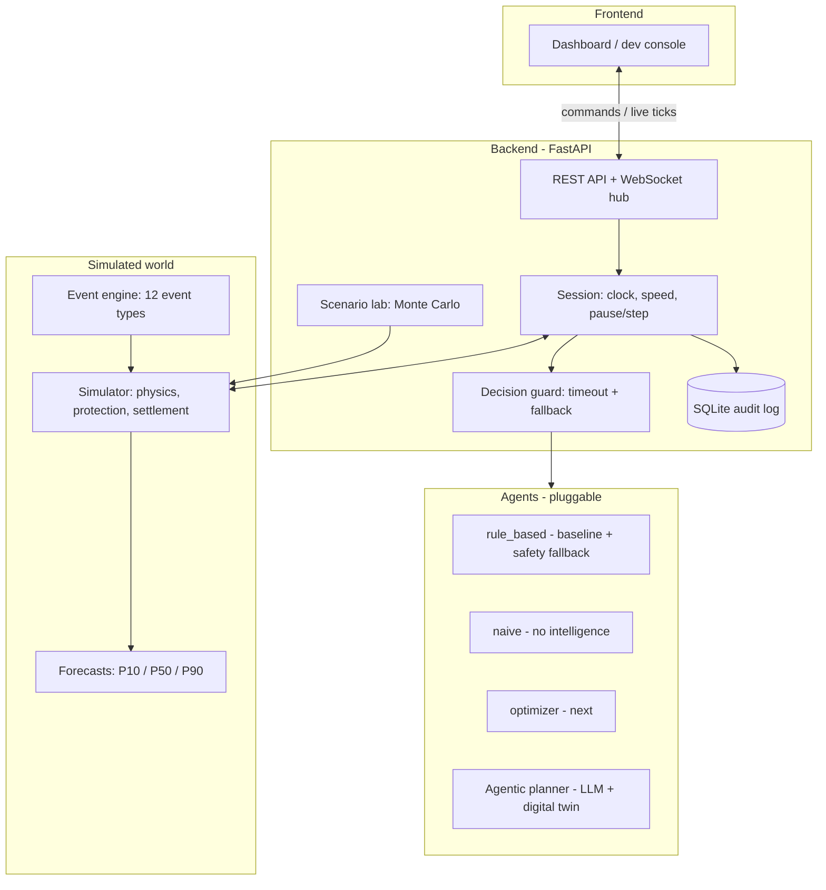

# Renewable Energy Orchestrator

**ET AI Hackathon: Agentic Edition (Accenture × Economic Times), Problem 4, Utilities**

This is an AI agent that runs a renewable-energy portfolio on its own. Every 15 minutes it looks at solar, wind, batteries, demand, grid limits and prices. It then decides what to do: charge or discharge, buy or sell, curtail, shift load, trigger demand response or dispatch crews. It explains every decision.

This repo currently contains **step 1: the simulator and backend**. The dashboard, optimizer and LLM planner plug into it (see [Plug-in points](#plug-in-points-for-the-team)).

---

## Run it locally (5 minutes)

You need Python 3.10+ (3.11 recommended).

```bash
cd backend
python -m venv .venv
# Windows:      .venv\Scripts\activate
# Mac / Linux:  source .venv/bin/activate
pip install -r requirements-dev.txt

uvicorn app.main:app --reload --port 8000
```

Then open:

| URL | What |
|---|---|
| http://localhost:8000 | **Dev console**: live charts, chaos buttons, decision log, scenario lab |
| http://localhost:8000/docs | Interactive API docs (try every endpoint) |
| ws://localhost:8000/ws | Live WebSocket stream (for the dashboard) |

To try it, pick "Evening storm", press **Play**, and watch the agent pre-charge the batteries when the 12:30 storm alert arrives.

**Tests** (54, about 8 s): `python -m pytest -q`

**CLI** (no server needed):

```bash
python -m app.cli scenarios                                   # list scenarios and agents
python -m app.cli run --scenario storm_alert -v               # every 15-min decision with reasons
python -m app.cli compare --all                               # naive vs rule_based on every scenario
python -m app.cli lab --scenario chaos_monkey --runs 50       # Monte Carlo (F3)
python -m app.cli run --scenario storm_alert --csv storm.csv  # export chart data (for slides)
```

**Docker:** `docker build -t reo backend && docker run -p 8000:8000 reo`

---

## Architecture



**One tick (every 15 simulated minutes, or immediately when an event fires):**

1. **Trigger:** the clock ticks, or an event is injected (e.g. the "Cloud cover" button).
2. **Observe:** the simulator builds what the agent is allowed to see: a noisy nowcast, a 24 h forecast with P10/P50/P90 bands, and alerts. Surprise events stay invisible until they start.
3. **Decide:** the agent returns a `Decision`. If it crashes, times out (8 s) or returns garbage, the rule-based agent takes over and the fallback is logged.
4. **Apply:** physics and protection run. Impossible actions are clipped and every clip is reported. The grid tie absorbs any mismatch up to line limits. Beyond that, protection steps in in this order: undo curtailment, stop charging, emergency battery (using the reserve), shed non-critical load, then critical load.
5. **Settle:** market trades are settled at the exchange price. Unplanned deviations are charged at penalty rates, doubled at low grid frequency. Carbon, battery wear, demand response, shift fees and value of lost load are all counted.
6. **Broadcast and log:** the tick goes to every WebSocket client and into SQLite.

### Folder map

```
backend/app/
  sim/                 the world
    assets.py          5 solar, 3 wind, 2 batteries, 5 consumers, 2 tie-lines
    profiles.py        seeded weather / demand / price / emission-factor curves
    events.py          12 event types, catalog, text bulletins
    scenarios.py       6 scripted days + random chaos generator
    engine.py          Simulator: observe(), apply_decision(), forecasts, settlement
    decision.py        the action vocabulary (tolerant JSON parsing for LLM output)
    kpis.py            KPIs + the objective function
  agents/              naive.py, rule_based.py, llm_planner.py, llm_providers.py, twin.py, base.py (interface), __init__.py (registry)
  runtime/             session.py (clock loop + fallback), hub.py (WebSocket), lab.py (Monte Carlo)
  api/                 routes.py, schemas.py
  store/db.py          SQLite audit log (runs, ticks, events, lab jobs)
  static/index.html    dev console
  cli.py
backend/tests/         physics invariants, agents, API, regressions
```

---

## The simulated utility

| Asset | Details |
|---|---|
| 5 solar farms | 300 MWp total (Rajasthan, Gujarat, Madhya Pradesh). Clear-sky curve shifted by longitude; regional clouds; heat derating |
| 3 wind farms | 190 MW total. Power curve: cut-in 3 m/s, rated 12 m/s, **cut-out 25 m/s** (storms shut turbines down) |
| 2 batteries | 100 MWh / 50 MW and 60 MWh / 30 MW. 94% charge and 94% discharge efficiency; SoC 10–95%; wear ₹1,200/MWh cycled; capacity fade |
| 5 consumers | Steel, cement, data centre, textile, city feeder (≈190–290 MW). Each has critical, DR-able and shiftable shares, a tariff and a daily DR budget |
| 2 tie-lines | 120 + 100 MW, import or export. Can be derated or tripped |
| Market | Exchange-style price (₹2,500/MWh at noon → ₹9,000+ in the evening, capped at ₹10,000); time-varying grid CO₂ factor; carbon price; DR incentive |

Everything is **seeded**: the same seed gives the identical day, so agents are compared on exactly the same conditions.

### Events (every example in the problem statement)

| Problem statement | Event type | Visible to agent |
|---|---|---|
| Clouds reduce solar output | `cloud_cover` | when it starts |
| Wind suddenly increases | `wind_change` | when it starts |
| Electricity prices spike | `price_spike` | when it starts |
| One battery becomes unavailable | `asset_fault` (8 h, or 1 h if a crew is sent) | when it starts |
| Transmission line reaches capacity | `line_derate` | when it starts |
| Industrial demand increases | `demand_surge` | when it starts |
| Weather forecasts are updated | `forecast_update` | **in advance** |
| Storm alerts | `storm` (with a text bulletin) | **in advance** |
| Maintenance schedules | `maintenance` (movable within a window) | **in advance** |
| Grid frequency / carbon / DR inputs | `frequency_dip`, `carbon_price_change`, `dr_incentive_change` | when it starts |

### Actions (the `Decision` object)

| Problem statement | Field |
|---|---|
| Charge / discharge / reserve capacity | `battery: {B1: {action, mw, reserve_soc}}` |
| Buy / sell / delay selling | `buy_mw`, `sell_mw` (delay = charge now, sell later) |
| Curtail wind / solar | `curtail_mw: {"S1": 10}` or `{"solar": 20, "wind": 5}` |
| Demand response / reduce non-critical / shift load | `demand_response_mw`, `reduce_noncritical_mw`, `shift_load: [{consumer_id, mw, delay_steps}]` |
| Delay / schedule maintenance / dispatch crews | `maintenance: [{action: delay\|schedule\|dispatch_inspection, ...}]` |
| Explainability | `mode`, `reasons[]`, `objective_weights` |

### Optimality criteria (made explicit)

Every run is scored with one money-denominated objective (lower is better). It is the weighted sum of these components:

- **energy**: net market plus deviation cost
- **carbon**: tCO₂ × carbon price
- **degradation**: battery wear
- **flexibility**: DR incentives, shift fees, controlled cuts, and tariff lost
- **reliability**: value of lost load
- **maintenance**: crew dispatch cost
- **curtailment**: wasted clean MWh × shadow price (weight 0 by default)

With default weights, minimising the objective equals maximising profit. An agent, such as the LLM planner, can change the weights per situation, for example "storm → reliability first". We always report both its own weighted score and the default score, so runs stay comparable.

---

## Dashboard (React)

`uvicorn app.main:app --port 8000` then open **http://localhost:8000** (the old dev console moved to `/console`).

* **Controls**: scenario, agent, seed, play/pause/step, speed.
* **KPI tiles**: profit, live saving vs the rule-based agent on the *same* day, unserved energy, clean share, CO₂.
* **Charts**: supply vs demand (storm windows shaded), battery charge, market price, and running cost of this agent vs rule-based and naive replays of the same day (`GET /api/baseline`).
* **Agent brain**: risk level, chosen plan, LLM reasoning and the digital-twin table of plans it tested.
* **Talk to the agent**: plain-language operator notes (`POST /api/agent/instruction`), and an event injector.

The built files live in `backend/app/static/dashboard`, so no Node.js is needed to run it. To change the UI: `cd frontend && npm install && npm run dev` (proxies to the backend on :8000), then `npm run build`.

## Agentic planner (`llm_planner`): LLM + digital twin

```
perceive ──► simulate ──► reason ──► verify ──► act
 brief:       digital twin   LLM judges risk,   guardrails:      plan configures
 state,       tests 9+ plans  picks a plan,      risk can only    the dispatcher;
 forecasts,   in expected &   may ask the twin   go UP; plan must physics guard and
 bulletins,   stress worlds   to test variants,  match the twin's rule fallback stay
 operator                     explains why       best within 0.2%
 notes
```

* **Digital twin** (`agents/twin.py`): built only from the observation (current state + published forecast), never from the simulator's hidden truth. It rolls the real dispatcher forward 12 h for each candidate plan (battery reserve floor, arbitrage style, risk look-ahead) and prices energy, carbon, demand-side actions, battery wear and blackouts.
* **LLM** (`agents/llm_providers.py`): any free OpenAI-compatible model, standard library only, with a tokens-per-minute budget and 429 back-off so free tiers are never exceeded. About 12 calls per simulated day, ~1.5k tokens each.
* **Operator in the loop**: `POST /api/agent/instruction {"text": "Cyclone warning tonight, keep batteries full"}`. The note goes into the next brief and triggers an immediate re-plan.
* **Never stuck**: no key, no internet, over budget or a bad reply? It runs perceive → simulate → verify → act without the LLM ("auto" mode) and logs why.

| Provider (`REO_LLM_PROVIDER`) | Cost | Set | Default model |
|---|---|---|---|
| `groq` | free tier, no card | `GROQ_API_KEY` | openai/gpt-oss-120b (auto-switches if retired) |
| `gemini` | free tier | `GEMINI_API_KEY` | gemini-2.5-flash |
| `openrouter` | free `:free` models | `OPENROUTER_API_KEY` | meta-llama/llama-3.3-70b-instruct:free |
| `ollama` | free, local, offline | nothing (run `ollama pull qwen2.5:7b`) | qwen2.5:7b |
| `mock` / no key | free | nothing | offline planner (twin + guardrails only) |

`auto` (default) uses the first free key it finds, else offline. For CLI and lab runs on a free tier, set `REO_LLM_WAIT=1` so the agent waits for the token budget instead of skipping the model (a 1-day run then takes a few minutes). For a slow local model, also set `REO_LLM_TIMEOUT=25 REO_DECISION_TIMEOUT=30`.

**Results (scenario lab, 20 randomised days per scenario, same days for both agents, offline mode):**

| Scenario | Planner better on | Saving per day | Unserved energy (rules → planner) |
|---|---|---|---|
| Random chaos | 85% of days | ₹2.02 L | 159.7 → 136.9 MWh (−14%) |
| Evening storm | 60% | ₹1.08 L | 75.6 → 57.4 MWh (−24%) |
| Monsoon clouds | 95% | ₹0.84 L | 0 → 0 |
| Normal day | 80% | ₹0.65 L | 0 → 0 |
| Grid congestion | 85% | ₹0.64 L | 0 → 0 |
| Heatwave peak | 70% | ₹0.40 L | 27.7 → 27.7 MWh |

These gains come from the twin + guardrails alone (no LLM). The LLM adds judgement on bulletins and operator notes, and the explanations; measure your model with the lab command below.

```bash
export GROQ_API_KEY=gsk_...            # free at console.groq.com
python -m app.cli run --scenario storm_alert --agent llm_planner --verbose
python -m app.cli lab --scenario storm_alert --agents rule_based,llm_planner --runs 20
```

## Current results (rule-based vs naive, same days)

| Scenario | Naive: unserved / profit | Rule-based: unserved / profit |
|---|---|---|
| Evening storm | 94.5 MWh / ₹148.6 L | **0 MWh / ₹174.8 L** |
| Heatwave + battery fault | 102.6 MWh / ₹73.7 L | **0.9 MWh / ₹100.1 L** |
| Congested grid | 74.7 MWh curtailed / ₹238.6 L | **68.3 MWh curtailed / ₹253.7 L** |
| 40 random chaos days | 3,819 MWh total blackout | **315 MWh (−92%)**, better on 100% of days |

The optimizer and LLM planner must beat the rule-based numbers. The scenario lab measures exactly that.

---

## API

### REST (full, interactive docs at `/docs`)

| Method | Path | Purpose |
|---|---|---|
| GET | `/api/meta` | Scenarios, agents, event catalog (with defaults), assets, objective weights |
| GET | `/api/snapshot` | Everything a dashboard needs to render (same as the first WebSocket message) |
| GET | `/api/observation` | Exactly what the agent sees right now |
| GET | `/api/history?since=0` | Chart points and decision log |
| GET | `/api/ticks?since=0&limit=96` | Full tick records (decision, applied actions, flows, costs, notes) |
| GET | `/api/kpis` · `/api/events` · `/api/status` | Cumulative KPIs, event timeline, clock status |
| POST | `/api/sim/reset` | `{scenario, seed, agent, days, speed, autostart}` |
| POST | `/api/sim/start` · `/pause` · `/resume` | Clock control |
| POST | `/api/sim/step` | `{steps: 1}` advance manually |
| POST | `/api/sim/speed` | `{speed: 300}` sim-seconds per real second (300 = 3 s per step) |
| POST | `/api/sim/agent` | `{agent: "naive"}` swap the decision maker mid-run |
| POST | `/api/events` | `{type, params, start_in_steps, duration_steps, announce_in_steps}` inject an event |
| POST / GET | `/api/lab/runs`, `/api/lab/runs/{id}` | Monte Carlo batch `{scenario, agents, runs, days, base_seed}` |
| GET | `/api/runs`, `/api/runs/{id}`, `/api/runs/{id}/ticks` | Audit log of past runs |

### WebSocket `/ws`

The first message is a `snapshot`. After that you receive:

| `type` | When | Key fields |
|---|---|---|
| `tick` | every step | `status`, `point` (compact chart row), `log` (actions + reasons), `tick` (full record), `kpis`, `observation` (next step), `events` |
| `event` | event injected | `event`, `observation`, `events` |
| `status` | play / pause / speed / agent change | `status` |
| `lab_progress`, `lab_done` | scenario lab | `job_id`, `progress` |
| `error` | problems | `message` |

Clients can also send `{"action": "start" | "pause" | "step" | "speed" | "event", ...}`.

---

## Plug-in points for the team

**New agent (optimizer, LLM planner):** subclass `Agent` and register it. It then shows up automatically in the API, the dev console, the CLI and the scenario lab.

```python
# backend/app/agents/optimizer.py
from .base import Agent
from ..sim.decision import Decision, BatteryCommand

class OptimizerAgent(Agent):
    name, label = "optimizer", "MILP optimizer"
    def decide_sync(self, obs: dict) -> Decision:        # or: async def decide(self, obs) for LLM calls
        fc = obs["forecast"]                             # 96-step P10/P50/P90 + limits + prices
        ...
        return Decision(agent=self.name, battery={"B1": BatteryCommand("charge", 20)},
                        buy_mw=40, reasons=["why"], objective_weights={"carbon": 2.0})

# backend/app/agents/__init__.py -> add OptimizerAgent to AGENT_CLASSES
```

- An LLM can return plain JSON. `Decision.from_dict` tolerates messy output, and anything impossible is clipped and reported.
- Test against a saved observation: `curl localhost:8000/api/observation > obs.json`.
- Compare against the baseline: `python -m app.cli lab --agents rule_based,optimizer --runs 50`.

**Dashboard:** connect to `/ws`, render from the `snapshot`, then append each `tick.point` to the charts. Use `GET /api/meta` → `events` to build the chaos buttons. The dev console (`app/static/index.html`) is a working reference in about 220 lines.

---

## Configuration (environment variables)

| Variable | Default | Meaning |
|---|---|---|
| `REO_SCENARIO` | `storm_alert` | scenario loaded at startup |
| `REO_AGENT` | `rule_based` | agent loaded at startup |
| `REO_SPEED` | `300` | sim seconds per real second |
| `REO_DECISION_TIMEOUT` | `8` | seconds before falling back to rule-based |
| `REO_DB_PATH` | `backend/data/reo.sqlite3` | audit log location |
| `REO_PERSIST` | `1` | `0` disables SQLite |
| `REO_CORS` | `*` | allowed origins, comma-separated |

## Assumptions and limits

- Data is synthetic but shaped on Indian conditions: IEX-like prices, CEA-like emission factors, DSM-like deviation penalties. The profile generator can be swapped for real CSVs later.
- The grid is a single bus behind two tie-lines. There is no internal power flow.
- The carbon price is a configurable shadow price (default ₹2,000/tCO₂).
