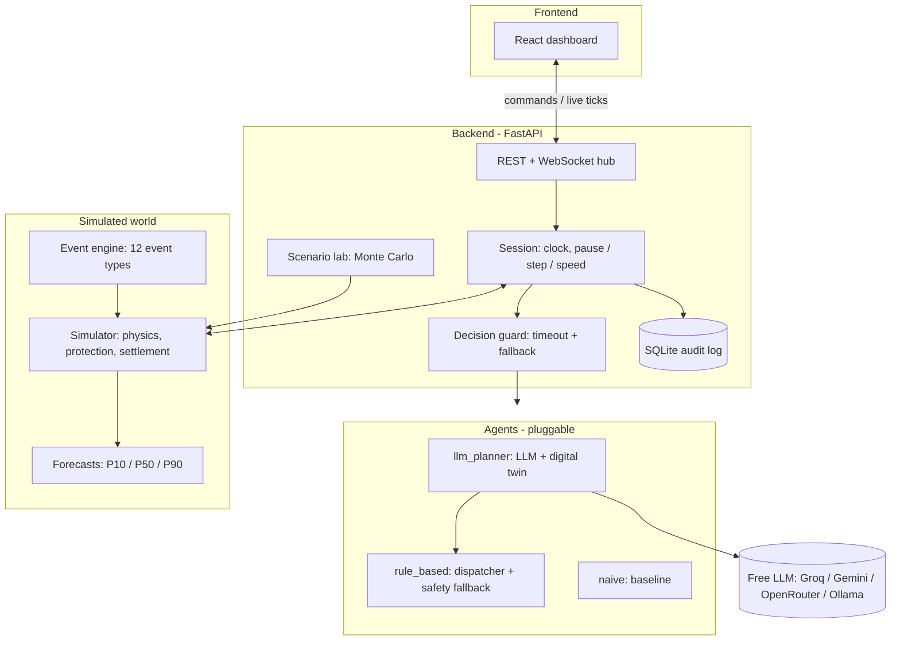

# Renewable Energy Orchestrator

**ET AI Hackathon: Agentic Edition (Accenture × Economic Times) · Problem 4 · Utilities**

An autonomous agent that runs a renewable-energy portfolio (solar, wind, batteries, grid and market) every 15 minutes, reacts to storms, faults and price spikes, and explains every decision. An LLM judges risk and reads bulletins and operator notes; a digital twin tests candidate plans before anything is applied; guardrails and a rule-based fallback keep the grid safe if the model fails. It runs on free LLMs (Groq, Gemini, OpenRouter, local Ollama) or fully offline.

| | |
|---|---|
| **Outcome** | Beats a careful rule-based operator on all 6 scenarios over 120 test days; cuts blackout energy by 14–24% in chaotic and storm days |
| **Stack** | Python 3.11 · FastAPI · NumPy · SQLite · React 18 + Recharts · any OpenAI-compatible LLM |
| **Cost to run** | ₹0: free LLM tiers or no LLM at all |

## Contents

1. [Quick start](#1-quick-start)
2. [Demo in 2 minutes](#2-demo-in-2-minutes)
3. [How it works](#3-how-it-works)
4. [The agentic planner](#4-the-agentic-planner)
5. [Results](#5-results)
6. [The simulated utility](#6-the-simulated-utility)
7. [Dashboard](#7-dashboard)
8. [CLI](#8-cli)
9. [API](#9-api)
10. [Configuration](#10-configuration)
11. [Project structure](#11-project-structure)
12. [Testing](#12-testing)
13. [Extending](#13-extending)
14. [Assumptions and limits](#14-assumptions-and-limits)

---

## 1. Quick start

You need Python 3.10+ (3.11 recommended). Node.js is **not** needed: the dashboard is pre-built.

```bash
cd backend
python -m venv .venv
# Windows: .venv\Scripts\activate      Mac / Linux: source .venv/bin/activate
pip install -r requirements-dev.txt
```

Optional, for the LLM (free, no card): create a key at [console.groq.com](https://console.groq.com).

```bash
# Mac / Linux
export GROQ_API_KEY=your-key
export REO_AGENT=llm_planner
uvicorn app.main:app --port 8000
```

```powershell
# Windows PowerShell
$env:GROQ_API_KEY="your-key"
$env:REO_AGENT="llm_planner"
python -m uvicorn app.main:app --port 8000
```

| URL | What |
|---|---|
| http://localhost:8000 | **Dashboard** (control room) |
| http://localhost:8000/docs | Interactive API docs |
| http://localhost:8000/console | Lightweight dev console |

Check the LLM connection any time with `python -m app.cli llm-check`.

**Docker:** `docker build -t reo backend && docker run -p 8000:8000 -e GROQ_API_KEY=your-key -e REO_AGENT=llm_planner reo`

---

## 2. Demo in 2 minutes

1. Open the dashboard, choose **Evening storm**, agent **Agentic planner**, press **Play**.
2. At about **12:30** a storm bulletin arrives. The *Agent brain* panel jumps to risk **critical**, the twin's table shows which reserve plans survive the bad case, and the batteries pre-charge.
3. During the storm (16:30–19:00) the agent releases the reserve, and the supply chart shows batteries covering the gap left by the derated tie-line.
4. Type an operator note such as *"Cyclone warning for tonight, keep batteries full"* and press **Send**: the agent re-plans immediately and explains how it used the note.
5. Inject an **Asset fault** from the Events panel and watch it dispatch a crew.
6. The *Running cost* chart and the *Saved vs rule-based* tile compare the agent against the same day replayed by the rule-based and naive agents.

---

## 3. How it works



**One tick (every 15 simulated minutes, or at once when an event fires):**

1. **Observe:** the agent gets what an operator could see: a noisy nowcast, a 24 h forecast with P10/P50/P90 bands, and alerts. Surprise events stay invisible until they start.
2. **Decide:** the agent returns a `Decision`. If it crashes, times out (8 s) or returns garbage, the rule-based agent takes over and the fallback is logged.
3. **Apply:** physics and protection run. Impossible actions are clipped and reported. Beyond line limits protection steps in: undo curtailment, stop charging, emergency battery, shed non-critical load, then critical load.
4. **Settle:** trades settle at the exchange price; deviations pay penalty rates (doubled at low frequency). Carbon, battery wear, demand response, shift fees and value of lost load are all counted.
5. **Broadcast and log:** the tick goes to every WebSocket client and into SQLite.

---

## 4. The agentic planner

```
perceive ──► simulate ──► reason ──► verify ──► act
 brief:       digital twin   LLM judges risk,   guardrails:       plan configures
 state,       tests 9+ plans  picks a plan,      risk can only     the dispatcher;
 forecasts,   in expected &   may ask the twin   go UP; plan must  physics guard and
 bulletins,   stress worlds   to test variants,  match the twin's  rule fallback stay
 operator                     explains why       best within 0.2%
 notes
```

The planner reviews every ~2 h, on every new event and on every operator note. Between reviews the dispatcher executes the chosen plan every 15 minutes.

| Part | File | What it does |
|---|---|---|
| Situation brief | `agents/llm_planner.py` | ~1k-token summary: state, forecast bands, bulletins, operator notes, risk detector, twin results |
| Digital twin | `agents/twin.py` | Rolls the real dispatcher 12 h forward for each plan in an **expected** (P50) and a **stress** (low renewables, high demand and price) world. Built only from the observation, never the simulator's hidden truth |
| Plans | `agents/twin.py` | Battery reserve floor (15–80%) × arbitrage style (conservative / normal / aggressive) × risk look-ahead (6 / 12 h) |
| LLM | `agents/llm_providers.py` | Any OpenAI-compatible model via tool calling. Standard library only. Tokens-per-minute budget, 429 back-off, auto-switch from retired models, one forced retry on malformed output |
| Guardrails | `agents/llm_planner.py` | 1) the model may **raise** the detector's risk level, never lower it; 2) its plan must score within 0.2% (min ₹20k) of the twin's best, else the best is used and the override is logged |
| Fallback | `runtime/session.py` | Any error, timeout or over-budget call: the planner keeps working without the LLM ("auto" mode), and the session falls back to rule-based if the agent itself fails |

**Free LLM providers**

| `REO_LLM_PROVIDER` | Cost | Needs | Default model |
|---|---|---|---|
| `groq` | free tier, no card | `GROQ_API_KEY` | `openai/gpt-oss-120b` (switches automatically if retired) |
| `gemini` | free tier | `GEMINI_API_KEY` | `gemini-2.5-flash` |
| `openrouter` | free `:free` models | `OPENROUTER_API_KEY` | `meta-llama/llama-3.3-70b-instruct:free` |
| `ollama` | free, local, offline | `ollama pull qwen2.5:7b` | `qwen2.5:7b` |
| `mock` | free | nothing | offline planner (twin + guardrails, no LLM) |

`auto` (default) picks the first key it finds, else offline. A simulated day uses about 15 calls and ~25k tokens, inside Groq's free limits.

---

## 5. Results

All comparisons use the scenario lab: identical randomised days (same weather, prices and events) for every agent.

**Agentic planner vs rule-based operator** (20 days per scenario, 120 days total):

| Scenario | Planner better on | Saving per day | Unserved energy (rules → planner) |
|---|---|---|---|
| Random chaos | 85% of days | ₹2.02 L | 159.7 → 136.9 MWh (−14%) |
| Evening storm | 60% | ₹1.08 L | 75.6 → 57.4 MWh (−24%) |
| Monsoon clouds | 95% | ₹0.84 L | 0 → 0 |
| Normal day | 80% | ₹0.65 L | 0 → 0 |
| Grid congestion | 85% | ₹0.64 L | 0 → 0 |
| Heatwave peak | 70% | ₹0.40 L | 27.7 → 27.7 MWh |

These numbers were measured in offline mode, so the gain comes from the digital twin and guardrails. The LLM's contribution is reading bulletins and operator notes, setting risk, and explaining decisions. Measure your own model with `REO_LLM_WAIT=1 python -m app.cli lab --scenario storm_alert --agents rule_based,llm_planner --runs 20`.

**Rule-based operator vs naive baseline:**

| Scenario | Naive: unserved / profit | Rule-based: unserved / profit |
|---|---|---|
| Evening storm | 94.5 MWh / ₹148.6 L | **0 MWh / ₹174.8 L** |
| Heatwave + battery fault | 102.6 MWh / ₹73.7 L | **0.9 MWh / ₹100.1 L** |
| Congested grid | 74.7 MWh curtailed / ₹238.6 L | **68.3 MWh curtailed / ₹253.7 L** |
| 40 random chaos days | 3,819 MWh total blackout | **315 MWh (−92%)**, better on 100% of days |

---

## 6. The simulated utility

| Asset | Details |
|---|---|
| 5 solar farms | 300 MWp (Rajasthan, Gujarat, Madhya Pradesh). Clear-sky curve by longitude, regional clouds, heat derating |
| 3 wind farms | 190 MW. Cut-in 3 m/s, rated 12 m/s, **cut-out 25 m/s** (storms stop turbines) |
| 2 batteries | 100 MWh / 50 MW and 60 MWh / 30 MW. 94% / 94% efficiency, SoC 10–95%, wear ₹1,200/MWh, capacity fade |
| 5 consumers | Steel, cement, data centre, textile, city feeder (≈190–290 MW). Critical, DR-able and shiftable shares, tariff, daily DR budget |
| 2 tie-lines | 120 + 100 MW, import or export. Can be derated or tripped |
| Market | Exchange-style price (₹2,500/MWh at noon → ₹9,000+ in the evening, cap ₹10,000), time-varying grid CO₂ factor, carbon price, DR incentive |

Everything is **seeded**: the same seed gives the identical day.

**Scenarios:** `normal_day`, `monsoon_clouds`, `heatwave_peak`, `storm_alert`, `grid_congestion`, `chaos_monkey` (random events).

**Events** (every example in the problem statement):

| Problem statement | Event type | Visible to agent |
|---|---|---|
| Clouds reduce solar output | `cloud_cover` | when it starts |
| Wind suddenly increases | `wind_change` | when it starts |
| Electricity prices spike | `price_spike` | when it starts |
| One battery becomes unavailable | `asset_fault` (8 h, or 1 h if a crew is sent) | when it starts |
| Transmission line reaches capacity | `line_derate` | when it starts |
| Industrial demand increases | `demand_surge` | when it starts |
| Weather forecasts are updated | `forecast_update` | **in advance** |
| Storm alerts | `storm` (with a text bulletin) | **in advance** |
| Maintenance schedules | `maintenance` (movable within a window) | **in advance** |
| Grid frequency / carbon / DR inputs | `frequency_dip`, `carbon_price_change`, `dr_incentive_change` | when it starts |

**Actions** (the `Decision` object):

| Problem statement | Field |
|---|---|
| Charge / discharge / reserve capacity | `battery: {B1: {action, mw, reserve_soc}}` |
| Buy / sell / delay selling | `buy_mw`, `sell_mw` (delay = charge now, sell later) |
| Curtail wind / solar | `curtail_mw: {"S1": 10}` or `{"solar": 20, "wind": 5}` |
| Demand response / reduce non-critical / shift load | `demand_response_mw`, `reduce_noncritical_mw`, `shift_load: [{consumer_id, mw, delay_steps}]` |
| Delay / schedule maintenance / dispatch crews | `maintenance: [{action: delay\|schedule\|dispatch_inspection, ...}]` |
| Explainability | `mode`, `reasons[]`, `objective_weights` |

**Objective** (one money figure, lower is better): energy (market + deviation) + carbon (tCO₂ × carbon price) + battery degradation + flexibility (DR, shifts, controlled cuts, lost tariff) + reliability (value of lost load) + maintenance + curtailment (weight 0 by default). With default weights, minimising it equals maximising profit.

---

## 7. Dashboard

React 18 + Recharts, served by the backend at `/` (built files in `backend/app/static/dashboard`).

| Area | Shows |
|---|---|
| Controls | Scenario, agent, seed, play / pause / step, speed |
| KPI tiles | Profit, saving vs rule-based on the same day, unserved energy, clean share, CO₂, emergency actions |
| Asset strip | Every farm, battery and line with live output and status |
| Charts | Supply vs demand (storm windows shaded), battery charge, market price, running cost vs rule-based and naive replays |
| Agent brain | Risk level, chosen plan, LLM / auto source, reasoning, the twin's plan table |
| Talk to the agent | Plain-language operator notes with examples |
| Events | Timeline and event injector |
| Decision log | Every 15-minute decision with reasons; filter to planner reviews |

To change the UI: `cd frontend && npm install && npm run dev` (proxies to the backend on :8000), then `npm run build`.

---

## 8. CLI

No server needed; run from `backend/`.

```bash
python -m app.cli scenarios                                          # list scenarios and agents
python -m app.cli llm-check                                          # test the free LLM connection
python -m app.cli run --scenario storm_alert --agent llm_planner -v  # every decision with reasons + LLM summary
python -m app.cli compare --all                                      # naive vs rule_based on every scenario
python -m app.cli compare --scenario storm_alert --agents rule_based,llm_planner
python -m app.cli lab --scenario chaos_monkey --agents rule_based,llm_planner --runs 20
python -m app.cli run --scenario storm_alert --csv storm.csv         # export chart data
```

On a free LLM tier, prefix batch runs with `REO_LLM_WAIT=1` so the agent waits for the token budget instead of skipping the model.

---

## 9. API

Interactive docs at `/docs`.

| Method | Path | Purpose |
|---|---|---|
| GET | `/api/meta` | Scenarios, agents, event catalog, assets, objective weights |
| GET | `/api/snapshot` | Everything a dashboard needs (same as the first WebSocket message), incl. the planner's latest directive |
| GET | `/api/observation` | Exactly what the agent sees right now |
| GET | `/api/baseline` | The current day replayed by the naive and rule-based agents (KPIs + cost curve) |
| GET | `/api/history?since=0` · `/api/ticks` | Chart points and decision log · full tick records |
| GET | `/api/kpis` · `/api/events` · `/api/status` | Cumulative KPIs, event timeline, clock status |
| POST | `/api/sim/reset` | `{scenario, seed, agent, days, speed, autostart}` |
| POST | `/api/sim/start` · `/pause` · `/resume` · `/step` · `/speed` | Clock control |
| POST | `/api/sim/agent` | `{agent}` swap the decision maker mid-run |
| POST | `/api/agent/instruction` | `{text}` plain-language operator note; triggers a re-plan |
| POST | `/api/events` | `{type, params, start_in_steps, duration_steps, announce_in_steps}` inject an event |
| POST / GET | `/api/lab/runs`, `/api/lab/runs/{id}` | Monte Carlo batch `{scenario, agents, runs, days, base_seed}` |
| GET | `/api/runs`, `/api/runs/{id}`, `/api/runs/{id}/ticks` | Audit log of past runs |

**WebSocket `/ws`:** the first message is a `snapshot`, then:

| `type` | When | Key fields |
|---|---|---|
| `tick` | every step | `status`, `point`, `log`, `tick`, `kpis`, `observation`, `events`, `planner` |
| `event` | event injected | `event`, `observation`, `events` |
| `instruction` | operator note | `text`, `agent`, `result` |
| `status` | play / pause / speed / agent change | `status` |
| `lab_progress`, `lab_done` | scenario lab | `job_id`, `progress` |
| `error` | problems | `message` |

Clients can also send `{"action": "start" | "pause" | "step" | "speed" | "event", ...}`.

---

## 10. Configuration

| Variable | Default | Meaning |
|---|---|---|
| `REO_AGENT` | `rule_based` | agent loaded at startup (`llm_planner`, `rule_based`, `naive`) |
| `REO_SCENARIO` | `storm_alert` | scenario loaded at startup |
| `REO_SPEED` | `300` | sim seconds per real second (300 = 3 s per step) |
| `REO_DECISION_TIMEOUT` | `8` | seconds before falling back to rule-based |
| `REO_LLM_PROVIDER` | `auto` | `groq`, `gemini`, `openrouter`, `ollama`, `mock` |
| `GROQ_API_KEY` / `GEMINI_API_KEY` / `OPENROUTER_API_KEY` | – | free provider keys |
| `REO_LLM_MODEL` · `REO_LLM_BASE_URL` | preset | override the model or endpoint |
| `REO_LLM_TPM` | per provider | tokens-per-minute budget |
| `REO_LLM_TIMEOUT` | `6` | seconds per LLM call (use ~25 for local Ollama, with `REO_DECISION_TIMEOUT=30`) |
| `REO_LLM_REVIEW_STEPS` | `8` | routine review interval (steps of 15 min) |
| `REO_LLM_MAX_CALLS` | `40` | hard cap on LLM calls per run |
| `REO_LLM_WAIT` | `0` | `1` = wait for budget instead of skipping (CLI / lab only) |
| `REO_DB_PATH` · `REO_PERSIST` | `backend/data/reo.sqlite3` · `1` | audit log location · `0` disables SQLite |
| `REO_CORS` | `*` | allowed origins, comma-separated |

Never commit API keys; set them as environment variables.

---

## 11. Project structure

```
backend/
  app/
    sim/              the world: assets, profiles, events, scenarios, engine, decision, kpis
    agents/           base (interface), naive, rule_based, twin, llm_providers, llm_planner
    runtime/          session (clock + fallback), hub (WebSocket), lab (Monte Carlo)
    api/              routes, schemas
    store/db.py       SQLite audit log
    static/           dashboard/ (built React app), index.html (dev console)
    cli.py · config.py · main.py
  tests/              physics invariants, agents, planner, API, regressions
  Dockerfile · requirements.txt · requirements-dev.txt
frontend/             React source (Vite): src/App.jsx, src/useOrchestrator.js, src/styles.css
```

---

## 12. Testing

```bash
cd backend && python -m pytest -q     # 67 tests, ~15 s, no network or API key needed
```

Covered: energy balance and physics invariants, protection order, settlement, every event type, agent benchmarks, the digital twin, planner guardrails (risk floor, twin override), LLM failure, rate-limit and retired-model handling, malformed tool calls, the API contract and the WebSocket stream.

---

## 13. Extending

Any decision maker is a subclass of `Agent` registered in `agents/__init__.py`; it then appears in the API, dashboard, CLI and scenario lab.

```python
from .base import Agent
from ..sim.decision import Decision, BatteryCommand

class OptimizerAgent(Agent):
    name, label = "optimizer", "MILP optimizer"
    def decide_sync(self, obs: dict) -> Decision:      # or async def decide(self, obs)
        return Decision(agent=self.name, battery={"B1": BatteryCommand("charge", 20)},
                        buy_mw=40, reasons=["why"])
```

`Decision.from_dict` tolerates messy JSON, and anything physically impossible is clipped and reported. Compare a new agent with `python -m app.cli lab --agents rule_based,optimizer --runs 50`.

---

## 14. Assumptions and limits

- Data is synthetic but shaped on Indian conditions: IEX-like prices, CEA-like emission factors, DSM-like deviation penalties. The profile generator can be swapped for real data.
- The grid is a single bus behind two tie-lines; there is no internal power flow.
- The carbon price is a configurable shadow price (default ₹2,000/tCO₂).
- Free LLM tiers have rate limits; the planner budgets for them and keeps working without the model when they are reached.
- The digital twin is a reduced model; its cost estimates guide plan choice and are not settlement figures.
